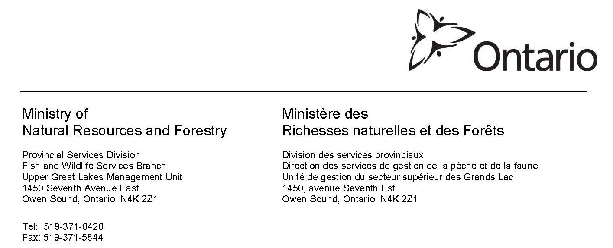

```{r setup, include=FALSE}
```
{fig.align=('topcenter'), fig.caption=FALSE}

`r format(Sys.time(), '%B %d, %Y')`

```{r general info, echo=FALSE, include=FALSE}


#load the required packages
library(RPostgreSQL)
library(sp)
library(leaflet)
library(htmlwidgets)
library(webshot)
#library(ggplot2)
#library(ggmap)


#set image size for map (higher the numbers the wider area the image will cover)
MAPWIDTH <- params$MAPWIDTH
MAPHEIGHT <- params$MAPHEIGHT
RECOVERY_EVENT <- params$RECOVERY_EVENT


map.namehtml <- file.path(getwd(), sprintf("_Map-%s.html", RECOVERY_EVENT))
map.namepng <- file.path(getwd(), sprintf("_Map-%s.png", RECOVERY_EVENT))

#set up a connection to the database
pg = dbDriver("PostgreSQL")
con = dbConnect(pg, user="uglmu",
                password="uglmu",
                host="142.143.160.56",
                port=5432,
                dbname="tfat")

# there are 3 pieces of information needed to populate our letter:
# + information about the recovery event
# + the tagging event
# + the number of tags applied to that species in that year.

#=================================
#       Recovery Event
#the recovery event number comes from TFAT

sql <-
"SELECT first_name || ' ' || last_name AS recovered_by,
       recovery_date,
       general_location,
       specific_location,
       species_code AS spc,
       common_name,
       tagid,
       dd_lat,
       dd_lon,
       tlen,
       rwt
FROM tfat_recovery recovery
  JOIN tfat_report report ON report.id = recovery.report_id
  JOIN tfat_joepublic joe ON joe.id = report.reported_by_id
  JOIN tfat_species AS species ON species.id = recovery.spc_id
WHERE recovery.id = $1;
"
tag_report <- dbGetQuery(con, sql, RECOVERY_EVENT)

#=================================
#       Tagging Event
# the recovery event number comes from TFAT
sql <- "
SELECT prj_cd,
       prj_nm,
       year,
       species_code AS spc,
       observation_date,
       dd_lat,
       dd_lon,
       tlen,
       sex,
       rwt
FROM tfat_encounter AS encounter
join tfat_project as project on project.id=encounter.project_id
join tfat_species as species on species.id=encounter.spc_id
where tagstat in ('A', 'A2')
and tagid = $1
and species_code=$2;
"
tagging_event<- dbGetQuery(con, sql, c(tag_report$tagid, tag_report$spc))


# number of tags applied to the same species in the same year:
sql <- "
SELECT COUNT(*)
FROM tfat_encounter AS encounter
  JOIN tfat_project AS project ON project.id = encounter.project_id
  JOIN tfat_species AS species ON species.id = encounter.spc_id
WHERE tagstat IN ('A','A2')
AND   year = $1
AND   species_code = $2;

"
tag_count <- dbGetQuery(con, sql, c(tagging_event$year, tagging_event$spc))

dbDisconnect(con)

species_name <- tag_report$common_name
tagid <- tag_report$tagid

```

Dear `r tag_report$recovered_by`,

Thank you for the information you provided to the Upper Great Lakes
Management Unit (UGLMU), Lake Huron Office, regarding a tagged
`r species_name` that you captured in
`r tag_report$general_location`. I am pleased to
provide you with the following information on your tagged
`r species_name`.


The tag number reported for this `r species_name` (#`r tagid`) was
from a fish captured during our `r tagging_event$prj_nm` project, and
part of  `r tag_count` `r species_name` tagged in
`r tagging_event$year`. Captured fish
are biologically sampled and tagged prior to being released in order
to establish movement patterns and growth rates should they be
recaptured at a later date. These surveys help us understand the
status of `r species_name` populations, population size and harvest
estimates based on recapture rates. As well tagging helps determine
spawning location and frequency, and aids in the understanding of home
range size. The specific information on the `r species_name` you
captured is provided.

```{r calculations, echo=FALSE, include=FALSE, warnings= FALSE}

start <- as.matrix(tagging_event[c("dd_lon", "dd_lat")], ncol=2)
finish <- as.matrix(tag_report[c("dd_lon", "dd_lat")], ncol=2)

delta_km <- spDistsN1(matrix(start, ncol=2), matrix(finish, ncol=2),
                     longlat = TRUE)

delta_km <- sprintf("%0.2f", delta_km)

#calcuate the amount of time at large
delta_days <- as.numeric(tag_report$recovery_date -
                       tagging_event$observation_date)

#biological changes
delta_tlen <- tag_report$tlen - tagging_event$tlen

#average growth rate between tagging and recapture in mm/year

growth <- delta_tlen / (delta_days / 364)
growth <- sprintf("%0.1f", growth)

sex <- switch(tagging_event$sex,
              "1" = "Male",
              "2" = "Female",
              "Unknown")

#the last part of the next paragraph can only be populated if we have
#length at recovery and a diffence between capture events:
if (!is.na(tag_report$tlen) & !is.na(delta_tlen)) {
  sentence <- "  and
based on the measurements provided (%s mm) gained
about %s mm in length during this time. This is a growth
rate of %s mm per year"
  tlen_sentence <- sprintf(sentence, tag_report$tlen, delta_tlen, growth)
} else {
  tlen_sentence <- '.'
}


```
Tag #`r tagid`, Gender: `r sex`

This `r species_name` was initially tagged on
`r format(tagging_event$observation_date, "%B %d, %Y")`, at
`r sprintf("%.3f", tagging_event$dd_lat) `°N
`r sprintf("%.3f", tagging_event$dd_lon) `°W, about
`r delta_km ` km from the reported recapture location. At that time, this
`r species_name` had a total length of `r tagging_event$tlen` mm, and
weighed `r tagging_event$rwt` g. This `r species_name` had been at large
for `r as.character(delta_days)` days since its initial capture
`r tlen_sentence `.

Thanks again for your support and interest in our Tag Recovery Program
and if you have any further questions please feel free to contact me
at your convenience.

Sincerely,

    Upper Great Lakes Management Unit, Lake Huron Office
    Ministry of Natural Resources and Forestry


```{r map, echo=FALSE, include=FALSE, results='hide', warning=FALSE, fig.align= 'centered'}


center_pt <- (start + finish)/2

icon.tag <- makeAwesomeIcon(icon = "tag", markerColor = "red")

map <- leaflet()
map <- addTiles(map)
map <- addProviderTiles(map, "OpenStreetMap.Mapnik")
#tagging event
map <- addAwesomeMarkers(map, lng=tagging_event$dd_lon,
  lat=tagging_event$dd_lat, icon = icon.tag)
#recovery event
map <- addCircleMarkers(map, lng=tag_report$dd_lon, lat=tag_report$dd_lat,
  opacity=1, color = "purple")

saveWidget(map, map.namehtml , selfcontained = TRUE)
webshot(map.namehtml, file=map.namepng, vwidth = MAPWIDTH, vheight = MAPHEIGHT)

```

```{r print map, echo=FALSE,include=TRUE, fig.class= 'center'}
pic <- png::readPNG(map.namepng, native=TRUE, info=TRUE)
grid::grid.raster(pic, just = "centre")
```
Figure 1: Map indicating the original tag location (red tag marker), and the recapture location (purple circle).
